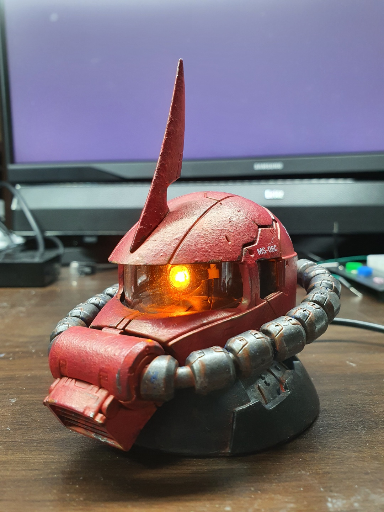
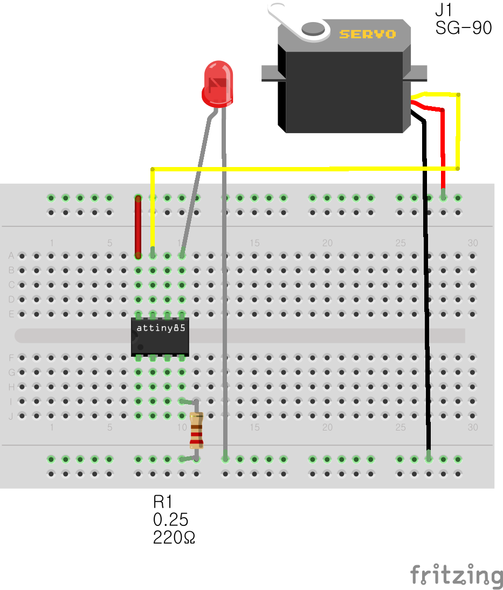

# 자쿠 헤드의 모노 아이 깜박이기

아두이노를 이용해 자쿠 헤드의 모노 아이를 움직이고, LED를 깜박거립니다.

# 준비물
- ATTINY85 (Micro USB 5pin type)
- LED
- SG-90 servo-mortor

# Breadboard

- Pin #0 : LED
- Pin #2 : Servo motor

# 라이브러리
- ServoATtiny85